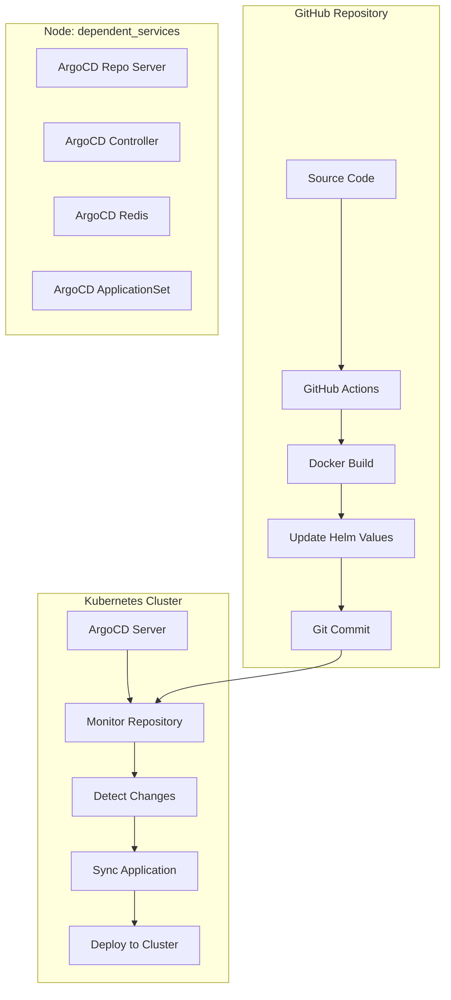

# ArgoCD Implementation Plan for Student API

## 🎯 Project Overview
This document outlines the complete implementation of ArgoCD for GitOps-based deployment of the Student API application stack.

## 📋 Implementation Requirements
- **Target Node**: Deploy all ArgoCD components on `dependent_services` node
- **GitOps Approach**: Declarative configuration using Kubernetes manifests
- **Source of Truth**: Helm charts in Git repository
- **Auto-sync**: Enable automatic deployment on Git changes
- **CI/CD Integration**: GitHub Actions updates Helm values and commits changes

## 🏗️ Architecture Overview



## 📦 Implementation Phases

### **Phase 1: ArgoCD Installation (✅ Ready)**
- [x] Create ArgoCD namespace
- [x] Deploy ArgoCD using Helm with custom values
- [x] Configure node selectors for `dependent_services` node
- [x] Set up NodePort services for external access
- [x] Create installation scripts (PowerShell + Bash)

### **Phase 2: ArgoCD Configuration (✅ Ready)**
- [x] Implement App-of-Apps pattern
- [x] Create ArgoCD Application for student-api-stack
- [x] Configure repository access
- [x] Set up auto-sync policies
- [x] Configure health checks and retry mechanisms

### **Phase 3: CI/CD Integration (✅ Ready)**
- [x] Enhance GitHub Actions workflow
- [x] Add automatic image tag generation
- [x] Implement Helm values update mechanism
- [x] Add auto-commit functionality
- [x] Create helper scripts for manual operations

### **Phase 4: Testing & Documentation (⏳ Pending)**
- [ ] Deploy ArgoCD on local cluster
- [ ] Test complete GitOps workflow
- [ ] Validate auto-sync on code changes
- [ ] Test rollback capabilities
- [ ] Update main README

## 🛠️ Technical Implementation

### **ArgoCD Components**
All components deployed with `nodeSelector: type: dependent_services`:

1. **ArgoCD Server**
   - Web UI and API server
   - NodePort: 30080 (HTTP), 30443 (HTTPS)
   - Insecure mode for internal access

2. **ArgoCD Repository Server**
   - Git repository management
   - Helm chart processing

3. **ArgoCD Application Controller**
   - Application lifecycle management
   - Kubernetes resource synchronization

4. **ArgoCD Redis**
   - Caching and session storage

5. **ArgoCD ApplicationSet Controller**
   - Multi-application management
   - Template-based app generation

### **GitOps Workflow**
1. **Developer pushes code** → GitHub repository
2. **GitHub Actions triggered** → Build, test, create Docker image
3. **Image tagged** with `branch-commit-timestamp` format
4. **Helm values updated** with new image tag
5. **Changes committed** back to repository
6. **ArgoCD detects change** → Automatic sync triggered
7. **Application deployed** with new image

### **Repository Structure**
```
student-api/k8s/
├── argocd/
│   ├── argocd-values.yaml          # Helm values for ArgoCD
│   ├── install-argocd.ps1          # Installation script (PowerShell)
│   ├── install-argocd.sh           # Installation script (Bash)
│   ├── README.md                   # ArgoCD setup instructions
│   └── applications/
│       ├── app-of-apps.yaml        # Root application
│       ├── student-api-stack.yaml  # Student API application
│       ├── student-api-project.yaml # Project configuration
│       ├── repository-config.yaml  # Repository access
│       └── README.md               # Applications documentation
├── helm-charts/
│   └── student-api-stack/          # Main Helm chart
└── scripts/
    └── update-helm-values.ps1      # Helper script
```

## 🔧 Configuration Details

### **Node Selector Configuration**
```yaml
nodeSelector:
  type: "dependent_services"
```

### **Auto-sync Policy**
```yaml
syncPolicy:
  automated:
    prune: true
    selfHeal: true
  retry:
    limit: 5
    backoff:
      duration: 5s
      factor: 2
      maxDuration: 3m
```

### **Health Checks**
- Kubernetes native health checks
- Custom health checks for Flask applications
- Readiness and liveness probes

## 🚀 Deployment Instructions

### **Prerequisites**
- Kubernetes cluster with labeled nodes
- Helm 3.x installed
- kubectl configured
- Git repository access

### **Installation Steps**
1. **Prepare Environment**
   ```powershell
   # Ensure node is labeled
   kubectl label node minikube-m03 type=dependent_services
   ```

2. **Install ArgoCD**
   ```powershell
   cd student-api/k8s/argocd
   .\install-argocd.ps1
   ```

3. **Deploy Applications**
   ```powershell
   kubectl apply -f applications/
   ```

4. **Verify Installation**
   ```powershell
   kubectl get pods -n argocd
   kubectl get applications -n argocd
   ```

### **Access Information**
- **ArgoCD UI**: `http://cluster-ip:30080`
- **Default Credentials**: admin / (generated password)
- **CLI Access**: `argocd login cluster-ip:30080`

## 🔍 Monitoring & Troubleshooting

### **Health Monitoring**
- ArgoCD UI dashboard
- Application status monitoring
- Sync status and history
- Resource health checks

### **Common Issues**
1. **Node Scheduling**: Ensure `dependent_services` node is ready
2. **Repository Access**: Verify Git credentials and permissions
3. **Helm Chart Issues**: Check chart syntax and dependencies
4. **Network Connectivity**: Validate cluster networking

### **Troubleshooting Commands**
```bash
# Check ArgoCD pods
kubectl get pods -n argocd

# View ArgoCD logs
kubectl logs -n argocd deployment/argocd-server

# Check application status
kubectl get applications -n argocd

# Describe application for details
kubectl describe application student-api-stack -n argocd
```

## 📊 Success Metrics

### **Deployment Success**
- [ ] All ArgoCD components running on `dependent_services` node
- [ ] ArgoCD UI accessible via NodePort
- [ ] Applications successfully deployed and synced
- [ ] Auto-sync working on Git changes

### **Performance Metrics**
- Sync time: < 2 minutes
- Application health: 100% ready
- Resource utilization: Within node capacity
- Network connectivity: All services accessible

## 🔄 Maintenance

### **Regular Tasks**
- Monitor ArgoCD component health
- Update ArgoCD version quarterly
- Review and rotate access credentials
- Clean up old application revisions

### **Backup Strategy**
- Export ArgoCD applications: `argocd app list -o yaml`
- Backup repository configurations
- Document custom configurations

## 📚 References
- [ArgoCD Official Documentation](https://argo-cd.readthedocs.io/)
- [GitOps Principles](https://www.gitops.tech/)
- [Helm Charts Best Practices](https://helm.sh/docs/chart_best_practices/)
- [Kubernetes Node Selectors](https://kubernetes.io/docs/concepts/scheduling-eviction/assign-pod-node/)

---

**Status**: Implementation Ready ✅  
**Last Updated**: June 3, 2025  
**Next Phase**: Testing and Documentation
