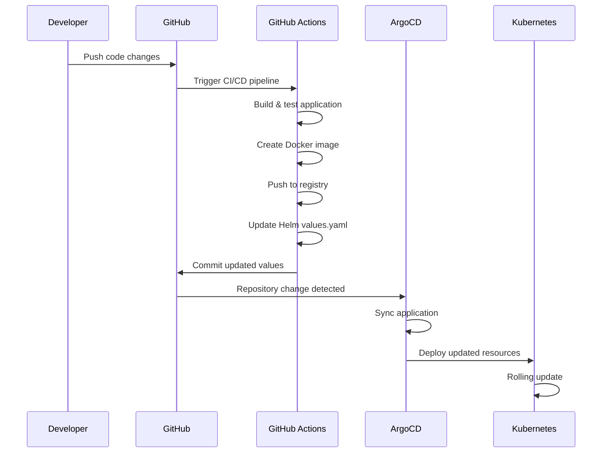

# ArgoCD GitOps Setup for Student API

This directory contains the complete ArgoCD setup for implementing GitOps-based deployment of the Student API application stack.

## 🎯 Overview

**ArgoCD** is a declarative GitOps continuous delivery tool for Kubernetes. This setup enables:

- **Automated Deployments**: Sync applications automatically when Git changes
- **Declarative Configuration**: All configurations stored in Git as source of truth
- **Multi-Application Management**: App-of-Apps pattern for managing complex deployments
- **Node-Specific Deployment**: All ArgoCD components deployed on `dependent_services` node

## 📁 Directory Structure

```
argocd/
├── argocd-values.yaml          # Helm values for ArgoCD installation
├── install-argocd.ps1          # PowerShell installation script
├── install-argocd.sh           # Bash installation script
├── README.md                   # This documentation
└── applications/
    ├── app-of-apps.yaml        # Root application (App-of-Apps pattern)
    ├── student-api-stack.yaml  # Student API application definition
    └── README.md               # Applications documentation
```

## 🚀 Quick Start

### **Prerequisites**

1. **Kubernetes Cluster** with labeled nodes:
   ```powershell
   kubectl label node minikube-m03 type=dependent_services
   ```

2. **Required Tools**:
   - kubectl (configured for your cluster)
   - Helm 3.x
   - Git

3. **Node Requirements**:
   - Node labeled with `type=dependent_services`
   - Sufficient resources (minimum 2 CPU, 4GB RAM)

### **Installation Steps**

1. **Install ArgoCD**:
   ```powershell
   cd student-api\k8s\argocd
   .\install-argocd.ps1
   ```

2. **Deploy Applications**:
   ```powershell
   kubectl apply -f applications\app-of-apps.yaml
   ```

3. **Access ArgoCD UI**:
   - URL: `http://your-cluster-ip:30080`
   - Username: `admin`
   - Password: Retrieved during installation

## 🔧 Configuration Details

### **ArgoCD Components**

All components are configured with `nodeSelector: type: "dependent_services"`:

- **ArgoCD Server**: Web UI and API (NodePort 30080/30443)
- **Repository Server**: Git repository management
- **Application Controller**: Application lifecycle management
- **Redis**: Caching and session storage
- **ApplicationSet Controller**: Multi-application management

### **Node Selector Configuration**

```yaml
nodeSelector:
  type: "dependent_services"
```

This ensures all ArgoCD components run on your designated monitoring/services node.

### **Network Access**

- **HTTP**: Port 30080 (NodePort)
- **HTTPS**: Port 30443 (NodePort)
- **Internal**: Service discovery within cluster

## 🔄 GitOps Workflow

### **Complete Pipeline**



### **Automatic Sync**

ArgoCD monitors the Git repository and automatically:
1. Detects changes in Helm values
2. Syncs the application state
3. Deploys new container images
4. Monitors application health

## 🛠️ Management Commands

### **ArgoCD Installation**

```powershell
# Install ArgoCD
.\install-argocd.ps1

# Uninstall ArgoCD
.\install-argocd.ps1 -Uninstall

# Check installation status
kubectl get pods -n argocd
```

### **Application Management**

```powershell
# Deploy applications
kubectl apply -f applications\

# List applications
kubectl get applications -n argocd

# Check application status
kubectl describe application student-api-stack -n argocd

# Force sync application
argocd app sync student-api-stack
```

### **Access Management**

```powershell
# Get admin password
kubectl -n argocd get secret argocd-initial-admin-secret -o jsonpath="{.data.password}" | %{[System.Text.Encoding]::UTF8.GetString([System.Convert]::FromBase64String($_))}

# Port forward for local access
kubectl port-forward svc/argocd-server -n argocd 8080:443

# Login via CLI
argocd login localhost:8080 --username admin --password <password> --insecure
```

## 📊 Monitoring & Troubleshooting

### **Health Checks**

Monitor ArgoCD and application health:

```powershell
# ArgoCD components status
kubectl get pods -n argocd

# Application sync status
kubectl get applications -n argocd

# Detailed application info
argocd app get student-api-stack
```

### **Common Issues**

1. **Pods Pending**: Check node labels and resources
   ```powershell
   kubectl get nodes --show-labels
   kubectl describe node minikube-m03
   ```

2. **Sync Failures**: Check repository access and Helm chart validity
   ```powershell
   argocd app get student-api-stack
   kubectl logs -n argocd deployment/argocd-server
   ```

3. **Network Access**: Verify NodePort services
   ```powershell
   kubectl get svc -n argocd
   kubectl get nodes -o wide
   ```

### **Logs and Debugging**

```powershell
# ArgoCD server logs
kubectl logs -n argocd deployment/argocd-server

# Repository server logs
kubectl logs -n argocd deployment/argocd-repo-server

# Application controller logs
kubectl logs -n argocd deployment/argocd-application-controller

# Specific application logs
argocd app logs student-api-stack
```

## 🔐 Security Configuration

### **RBAC**

ArgoCD is configured with:
- **Admin user**: Full access to all applications
- **Project-based access**: Limited to student-api resources
- **Repository restrictions**: Only allowed Git repositories

### **Network Security**

- **Insecure mode**: Enabled for internal cluster communication
- **NodePort access**: Limited to cluster network
- **TLS**: Available on port 30443 for secure access

### **Secret Management**

- **Repository secrets**: Stored as Kubernetes secrets
- **Application secrets**: Managed by Helm charts
- **Auto-generated secrets**: Excluded from drift detection

## 🔄 Backup & Recovery

### **Backup ArgoCD Configuration**

```powershell
# Export applications
argocd app list -o yaml > argocd-apps-backup.yaml

# Export projects
argocd proj list -o yaml > argocd-projects-backup.yaml

# Backup repository configurations
kubectl get secrets -n argocd -l argocd.argoproj.io/secret-type=repository -o yaml > argocd-repos-backup.yaml
```

### **Disaster Recovery**

```powershell
# Reinstall ArgoCD
.\install-argocd.ps1 -Uninstall
.\install-argocd.ps1

# Restore configurations
kubectl apply -f argocd-apps-backup.yaml
kubectl apply -f argocd-projects-backup.yaml
kubectl apply -f argocd-repos-backup.yaml
```

## 📈 Performance Tuning

### **Resource Limits**

Adjust resource limits in `argocd-values.yaml`:

```yaml
server:
  resources:
    limits:
      cpu: 500m
      memory: 512Mi
    requests:
      cpu: 250m
      memory: 256Mi
```

### **Scaling**

- **Repository Server**: Scale for large repositories
- **Application Controller**: Scale for many applications
- **Redis**: Configure persistence for large clusters

## 🔗 Integration

### **GitHub Actions**

The CI/CD pipeline in `.github/workflows/gitops-pipeline.yaml` automatically:
1. Updates Helm values with new image tags
2. Commits changes to trigger ArgoCD sync
3. Provides deployment notifications

### **Monitoring Integration**

ArgoCD integrates with:
- **Prometheus**: Metrics collection
- **Grafana**: Dashboard visualization
- **Slack**: Notification alerts

### **Helm Integration**

ArgoCD uses Helm charts as the source of truth:
- **Chart Source**: `student-api/k8s/helm-charts/student-api-stack/`
- **Values Override**: CI/CD updates image tags
- **Template Processing**: Server-side rendering

## 📚 Additional Resources

- [ArgoCD Documentation](https://argo-cd.readthedocs.io/)
- [GitOps Principles](https://www.gitops.tech/)
- [App-of-Apps Pattern](https://argo-cd.readthedocs.io/en/stable/operator-manual/cluster-bootstrapping/)
- [Helm Chart Documentation](../helm-charts/student-api-stack/README.md)
- [GitHub Actions Workflow](../../../.github/workflows/gitops-pipeline.yaml)

## 🎯 Next Steps

1. **Install ArgoCD** using the provided scripts
2. **Deploy applications** using the App-of-Apps pattern
3. **Configure CI/CD** pipeline for automatic deployments
4. **Set up monitoring** and alerting
5. **Test the complete GitOps workflow**

---

**Status**: Ready for Deployment ✅  
**Maintained by**: DevOps Team  
**Last Updated**: June 3, 2025
