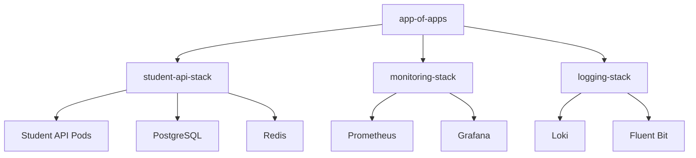

# ArgoCD Applications Documentation

This directory contains ArgoCD Application definitions that implement the **App-of-Apps pattern** for managing the Student API deployment using GitOps principles.

## 📁 File Structure

```
applications/
├── app-of-apps.yaml          # Root application (manages all other apps)
├── student-api-stack.yaml    # Main Student API application
└── README.md                 # This documentation
```

## 🏗️ App-of-Apps Pattern

The **App-of-Apps pattern** is a GitOps best practice where:

1. **Root Application** (`app-of-apps`) manages all other applications
2. **Child Applications** (like `student-api-stack`) deploy actual workloads
3. **Single Source of Truth**: All applications are defined in Git
4. **Hierarchical Management**: Changes to the app-of-apps trigger cascading updates



## 🚀 Deployment Instructions

### **1. Deploy Root Application**

Deploy the App-of-Apps root application:

```bash
kubectl apply -f app-of-apps.yaml
```

This will automatically create and manage all child applications.

### **2. Verify Deployment**

Check application status:

```bash
# List all ArgoCD applications
kubectl get applications -n argocd

# Check specific application
kubectl describe application student-api-stack -n argocd

# View application in ArgoCD UI
# http://your-cluster-ip:30080
```

### **3. Monitor Sync Status**

```bash
# Watch application sync status
kubectl get applications -n argocd -w

# Check application health
argocd app get student-api-stack --show-params
```

## 📋 Application Configurations

### **app-of-apps.yaml**

- **Purpose**: Root application that manages all other applications
- **Source**: `student-api/k8s/argocd/applications/`
- **Auto-sync**: Enabled with pruning and self-healing
- **Recurse**: Automatically discovers new application files

### **student-api-stack.yaml**

- **Purpose**: Deploys the complete Student API stack using Helm
- **Source**: `student-api/k8s/helm-charts/student-api-stack/`
- **Helm Values**: Uses `values.yaml` with CI/CD overrides
- **Target Namespace**: `student-api`
- **Auto-sync**: Enabled with retry policies

## 🔄 GitOps Workflow

### **How It Works**

1. **Code Change**: Developer pushes code to GitHub
2. **CI Pipeline**: GitHub Actions builds and pushes Docker image
3. **Update Values**: CI updates Helm values with new image tag
4. **Git Commit**: Changes are committed back to repository
5. **ArgoCD Sync**: ArgoCD detects changes and syncs applications
6. **Deployment**: New version is deployed to Kubernetes

### **Image Tag Updates**

The CI/CD pipeline automatically updates the image tag in `student-api-stack.yaml`:

```yaml
helm:
  parameters:
    - name: studentApi.image.tag
      value: "main-a1b2c3d-20240603-143022"  # Updated by CI/CD
```

## 🛠️ Customization

### **Environment-Specific Values**

Override values for different environments:

```yaml
# In student-api-stack.yaml
helm:
  values: |
    studentApi:
      replicaCount: 3  # Production override
      resources:
        requests:
          memory: "512Mi"
          cpu: "500m"
```

### **Adding New Applications**

1. Create a new application YAML file in this directory
2. The `app-of-apps` will automatically discover and deploy it
3. Ensure the application follows the same structure

### **Repository Configuration**

Update repository settings in `student-api-stack.yaml`:

```yaml
# For private repositories
stringData:
  type: git
  url: https://github.com/your-username/API_PROJECT
  username: your-github-username
  password: your-github-token
```

## 🔍 Troubleshooting

### **Common Issues**

1. **Application Not Syncing**
   ```bash
   # Force refresh
   argocd app sync student-api-stack
   
   # Check sync status
   argocd app get student-api-stack
   ```

2. **Repository Access Issues**
   ```bash
   # Check repository connection
   kubectl get secret student-api-repo -n argocd -o yaml
   
   # Test repository access
   argocd repo list
   ```

3. **Health Check Failures**
   ```bash
   # Check application health
   kubectl describe application student-api-stack -n argocd
   
   # Check pod status
   kubectl get pods -n student-api
   ```

### **Useful Commands**

```bash
# Sync application manually
argocd app sync student-api-stack

# Refresh application (re-read Git)
argocd app refresh student-api-stack

# Rollback to previous version
argocd app rollback student-api-stack

# Delete application (careful!)
argocd app delete student-api-stack

# Show application parameters
argocd app get student-api-stack --show-params

# Show application manifest
argocd app manifests student-api-stack
```

## 📊 Monitoring

### **Application Metrics**

- **Sync Status**: Success/Failed/OutOfSync
- **Health Status**: Healthy/Progressing/Degraded/Suspended
- **Sync History**: Last 10 sync operations
- **Resource Status**: Individual resource health

### **Notifications**

Configure notifications for:
- Sync success/failure
- Health degradation
- Configuration drift

### **ArgoCD UI**

Access the ArgoCD web interface:
- **URL**: `http://your-cluster-ip:30080`
- **Username**: `admin`
- **Password**: Retrieve using kubectl

## 🔐 Security

### **RBAC Configuration**

Applications use the `student-api-project` AppProject with:
- Limited source repositories
- Restricted destination namespaces
- Role-based access control

### **Secret Management**

- Repository credentials stored as Kubernetes secrets
- Sensitive values encrypted in Git
- Auto-generated secrets excluded from drift detection

## 📚 References

- [ArgoCD Documentation](https://argo-cd.readthedocs.io/)
- [App-of-Apps Pattern](https://argo-cd.readthedocs.io/en/stable/operator-manual/cluster-bootstrapping/)
- [GitOps Best Practices](https://www.gitops.tech/)
- [Helm Chart Documentation](../helm-charts/student-api-stack/README.md)
